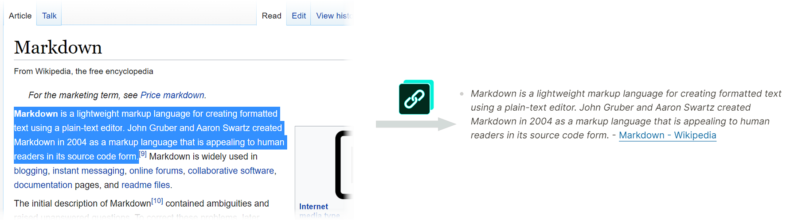

 

# Link-Md
Browser extension to create a markdown link of the current page with optional quote from selected text.



I built this browser extension for my own use of the [Logseq](https://logseq.com/), a note keeping application that uses [Markdown](https://daringfireball.net/projects/markdown/). This extension gives me a markdown link of the current tab with selected text included.

<a href="https://chrome.google.com/webstore/detail/link-md/nfjkoojhgklbbnlonpdplbdjkgoemgod" title="Chrome Extension"></a>

## Features
- Tested with Chrome, Edge, and Vivaldi. Should work in any modern Chromium browser.
- Tested with Firefox.
- Click the button or use the hotkey (default Alt + Shift + C) to copy the markdown to the clipboard. Paste the result into your destination.
- Selected text is put in italics followed by a link to the page. If no text is selected then just the link is created.
- Uses minimal code and permissions with no background process. Activating the extension inserts a 1 line function into the active tab to get any selected text.
- No 3rd party code is included in the plugin itself, referenced packages are only for testing and building.
- No data is collected and no calls are made to any websites.

## Install

### From Web Store
<a href="https://chrome.google.com/webstore/detail/link-md/nfjkoojhgklbbnlonpdplbdjkgoemgod">Chrome Web Store</a>

<a href="https://addons.mozilla.org/en-US/firefox/addon/link-md/">Firefox Browser Add-On</a>

### As Developer With Release
1. Download the latest [release](https://github.com/jadeohl/linkmd/releases) .zip for your browser family (Chrome includes Edge, or Mozilla includes Firefox) and expand it somewhere on your machine.
2. Follow the steps for manually loading extensions in your browser. Here they are for Chrome and Firefox. You should be able to search the steps for any browser or to get the following steps with screenshots: 
  - Chrome
     -  Go to "Manage Extensions"
     -  Enable "Developer mode"
     -  Click "Load upacked" and select the expanded folder
  - Firefox
     -   Open the about:debugging page
     -   Cick "This Firefox"
     -   Click "Load Temporary Add-on"
     -   Select any file in the expanded folder

### Build Your Own
1. Clone this repo.
2. Install NPM packages.
3. Run ```npx``` then ```webpack```.
4. A ```dist``` folder will be created with a subfolder for each browser.
5. Follow the _As Developer With Release_ instructions above using this dist folder.

## Future
- Option to set markdown format.

## Graphics
- Icon is based [on one by](https://www.veryicon.com/icons/miscellaneous/unionpay-digital-marketing/copy-link-face.html) Cady Weibo.
- Colors are #012a1c #67c7be
